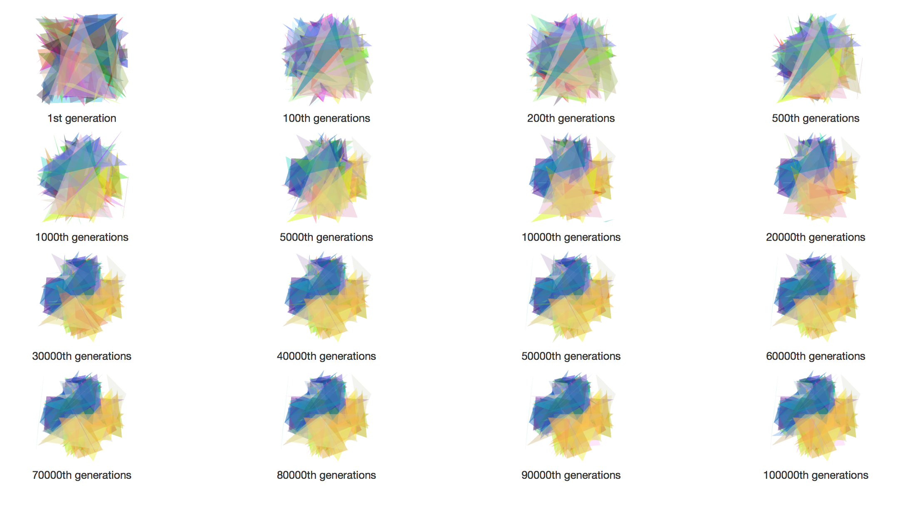
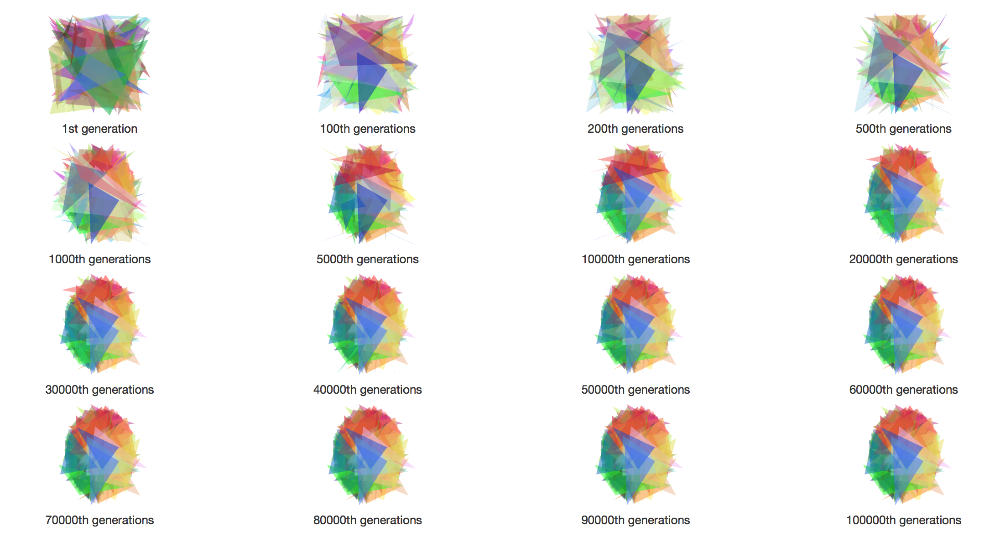
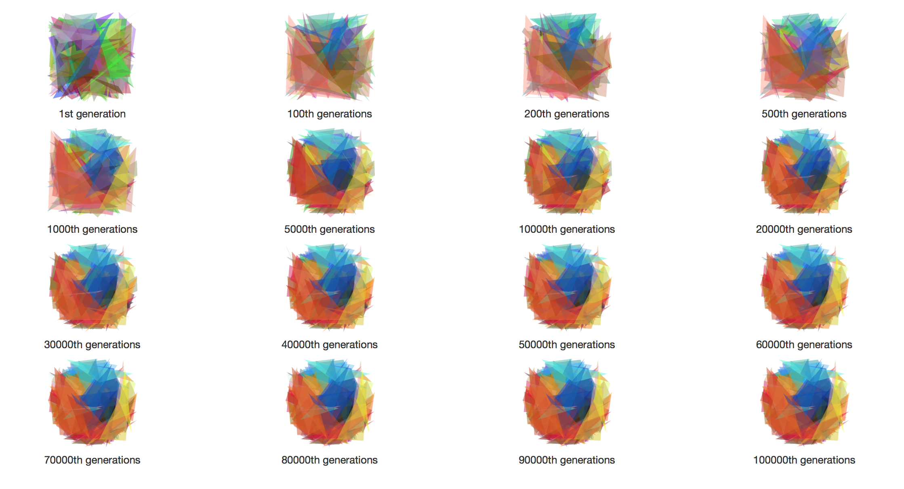
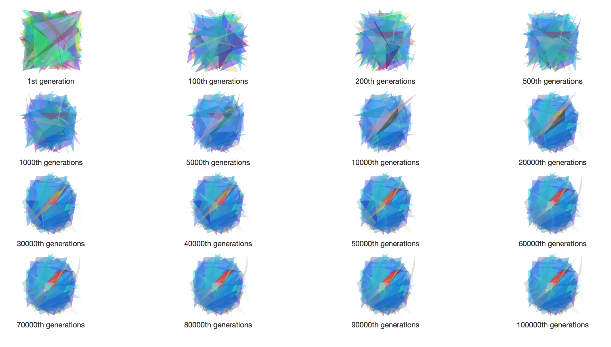
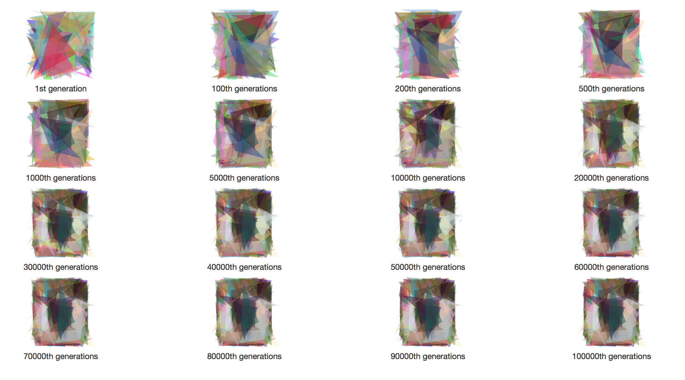
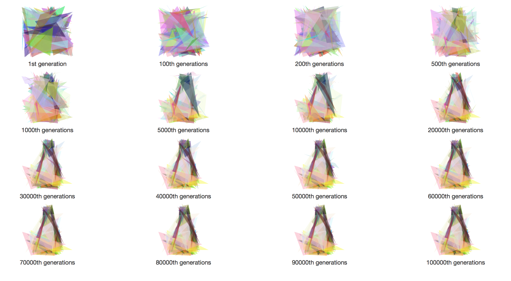

# Image Approximator

An image approximator inspired by [Genetic Programming: Evolution of Mona Lisa](http://rogeralsing.com/2008/12/07/genetic-programming-evolution-of-mona-lisa/).

## Introduction
This Python program uses genetic algorithm(GA) to approximate an image via several translucent triangles.

To use it, put the target image in the same folder and execute `evo.py`.

## Requirements
* [**Pillow**](https://pillow.readthedocs.org/en/3.0.x/index.html#) (a Python Image Library fork)

## Parameter Explanations

In `evo.py`:

`TARGET_IMG_NAME = 'test.jpg'`: The target image file name

`POP_SIZE = 25`: The GA population size. Generally, larger population size may lead to better result, but the running time will increase significantly.

`MUT_RATE = 0.05`: The mutation rate. Larger rate may prevent the population from getting stuck into local optimal. However, higher rate my let the algorithm turn into a primitive random search.

`GENERATIONS = 100000`: Number of generations. This is the termination condition.
 
`CHILDREN_PER_GEN = 5`: Number of children generated in each generation. Generally, large population need to generate more children.

`TRI_NUM = 100`: Number of translucent triangles that form the result image.

`BACKGROUND_COLOR = 'white'`: Although the program will approximate image with different background colors, this setting can help the program to achieve better result.

With default settings, the running time of the program is about 1 hour on my laptop.

## Sample Outputs
### Python Logo

### Ruby Logo

### Chrome Logo

### Firefox Logo

### Safari Logo

### Instagram Logo

### Tux

